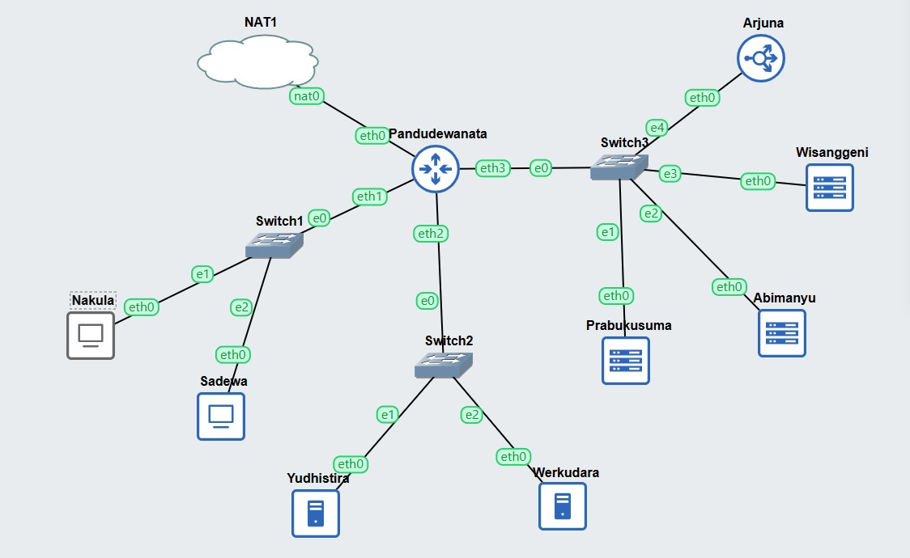
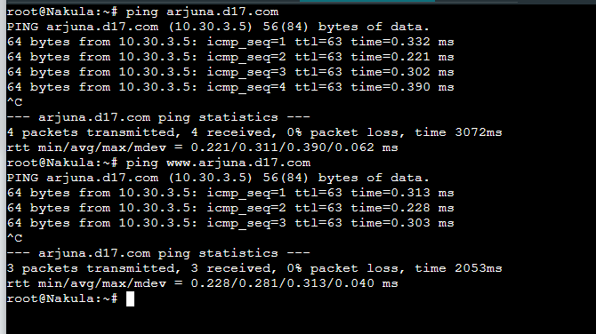

# Jarkom-Modul-2 D17-2023
**Praktikum Jaringan Komputer Modul 2 Tahun 2023**

## Author
| Nama | NRP |Github |
|---------------------------|------------|--------|
|Adam Haidar Azizi | 5025211114 | https://github.com/HADAIZI |
|Ahda Filza Ghaffaru | 5025211144 | https://github.com/Ahdaaa |

## Topologi
  

## Network Configs for Each Nodes

  - **Pandudewanata**
  ```
    auto eth0
    iface eth0 inet dhcp
    
    auto eth1
    iface eth1 inet static
    address 10.30.1.1
    netmask 255.255.255.0
    
    auto eth2
    iface eth2 inet static
    address 10.30.2.1
    netmask 255.255.255.0
    
    auto eth3
    iface eth3 inet static
            address 10.30.3.1
            netmask 255.255.255.0
  ```
  - **Nakula** 
  ```
    auto eth0
    iface eth0 inet static
    address 10.30.1.2
    netmask 255.255.255.0
    gateway 10.30.1.1

  ```
  - **Sadewa**
  ```
    auto eth0
    iface eth0 inet static
    address 10.30.1.3
    netmask 255.255.255.0
    gateway 10.30.1.1
  ```
  - **Yudhistira**
  
    ```
    auto eth0
        iface eth0 inet static
        address 10.30.2.2
        netmask 255.255.255.0
        gateway 10.30.2.1
    ```

  - **Werkudara**
  ```
   auto eth0
        iface eth0 inet static
        address 10.30.2.3
        netmask 255.255.255.0
        gateway 10.30.2.1
  ```

   
 - **Prabukusuma**
 ```
    auto eth0
    iface eth0 inet static
    address 10.30.3.2
    netmask 255.255.255.0
    gateway 10.30.3.1
 ```

 - **Abimanyu**
 ```
    auto eth0
    iface eth0 inet static
    address 10.30.3.3
    netmask 255.255.255.0
    gateway 10.30.3.1

 ```
 - **Wisanggeni**
 ```
    auto eth0
    iface eth0 inet static
    address 10.30.3.4
    netmask 255.255.255.0
    gateway 10.30.3.1
 ```
 - **Arjuna** 
 ```
    auto eth0
    iface eth0 inet static
    address 10.30.3.5
    netmask 255.255.255.0
    gateway 10.30.3.1
 ```

 - **Pandudewanata's .bashrc**
 ```
 iptables -t nat -A POSTROUTING -o eth0 -j MASQUERADE -s 10.30.0.0/16
 ```

 - **Other's .bashrc**
 ```
 echo nameserver 192.168.122.1 > /etc/resolv.conf
 ```

 ## Soal 1
 > Yudhistira akan digunakan sebagai DNS Master, Werkudara sebagai DNS Slave, Arjuna merupakan Load Balancer yang terdiri dari beberapa Web Server yaitu Prabakusuma, Abimanyu, dan Wisanggeni. Buatlah topologi dengan pembagian sebagai berikut. Folder topologi dapat diakses pada drive berikut
 ### Script 
 **Nakula dan Sadewa**
 ```
 ping google.com
 ```
 ### Result

 ## Soal 2
 > Buatlah website utama dengan akses ke arjuna.yyy.com dengan alias www.arjuna.yyy.com dengan yyy merupakan kode kelompok.
 
 ### Solusi

 Untuk melakukan pembuatan website utama dengan nama domain arjuna.yyy.com, berikut adalah tahapan-tahapan yang kami kerjakan.

 * Masuk ke node Yudhistira (*DNS Master*), lalu install bind-9 dengan cara berikut

 ```
 apt-get update
 apt-get install bind9 -y
 ```

 * Modifikasi file ``named.conf.local`` pada directory ``/etc/bind/named.conf.local``, dengan isi sebagaimana berikut

 ```
 zone "arjuna.d17.com" {
        type master;
        file "/etc/bind/jarkom/arjuna.d17.com";
 };
 ```

 * Buat folder baru pada directory ``/etc/bind/`` dengan nama ``jarkom``, kemudian copy file ``db.local`` pada directory ``/etc/bind/`` ke dalam   folder baru yang telah dibuat, dengan nama ``arjuna.d17.com``. Lalu, modifikasi file tersebut sebagaimana berikut.

 ```
 ;
 ; BIND data file for local loopback interface
 ;
 $TTL    604800
 @       IN      SOA     arjuna.d17.com. root.arjuna.d17.com. (
                      2022100601         ; Serial
                          604800         ; Refresh
                           86400         ; Retry
                         2419200         ; Expire
                          604800 )       ; Negative Cache TTL
 ;
 @       IN      NS      arjuna.d17.com.
 @       IN      A       10.30.3.5       ; IP Node Arjuna
 www     IN      CNAME   arjuna.d17.com.
 @       IN      AAAA    ::1
 ```
 
 * Lakukan testing website yang telah dibuat dengan cara masuk ke salah satu client (Nakula/Sadewa), pastikan nameserver pada client sudah menuju ke Yudhistira, lalu lakukan ping ke website tersebut.

 ```
 ping arjuna.d17.com
 ping www.arjuna.d17.com
 ```

### Result



## Soal 3
> Dengan cara yang sama seperti soal nomor 2, buatlah website utama dengan akses ke abimanyu.yyy.com dan alias www.abimanyu.yyy.com.

### Scipt
**Masuk ke Yudhistira**
```
nano /etc/bind/named.conf.local
zone "abimanyu.d17.com" {
    	type master;
    	file "/etc/bind/jarkom/abimanyu.d17.com";
};
 
cp /etc/bind/db.local /etc/bind/jarkom/abimanyu.d17.com
 
nano /etc/bind/jarkom/abimanyu.d17.com
;
; BIND data file for local loopback interface
;
$TTL	604800
@   	IN      SOA 	abimanyu.d17.com. root.abimanyu.d17.com. (
                 	2022100601     	; Serial
                     	604800     	; Refresh
                      	86400     	; Retry
                    	2419200     	; Expire
                     	604800 )   	; Negative Cache TTL
;
@   	IN      NS  	abimanyu.d17.com.
@   	IN      A   	10.30.2.2
@   	IN      AAAA	::1
 
service bind9 restart

```
 testing ping di client (nakula dan sadewa)
### Result

## Soal 4 
> Kemudian, karena terdapat beberapa web yang harus di-deploy, buatlah subdomain parikesit.abimanyu.yyy.com yang diatur DNS-nya di Yudhistira dan mengarah ke Abimanyu.

### Script
**Masuk Yudhistira**
```
nano /etc/bind/jarkom/abimanyu.d17.com
 
;
; BIND data file for local loopback interface
;
$TTL	604800
@   	IN      SOA 	abimanyu.d17.com. root.abimanyu.d17.com. (
                 	2022100601     	; Serial
                     	604800     	; Refresh
                      	86400     	; Retry
                    	2419200     	; Expire
                     	604800 )   	; Negative Cache TTL
;
@   	IN      NS  	abimanyu.d17.com.
@   	IN      A   	10.30.2.2   	; IP Yudhistira
www 	IN      CNAME   abimanyu.d17.com.
parikesit IN	A   	10.30.3.3   	; IP Abimanyu
@   	IN      AAAA	::1
 
service bind9 restart

```

**Masuk ke Nakula Sadewa**
```
ping parikesit.abimanyu.d17.com -c 5
```
### Result

## Soal 5
> Buat juga reverse domain untuk domain abimanyu
 
### Script
**Masuk Yudhistira**
```
nano /etc/bind/named.conf.local

zone "2.30.10.in-addr.arpa" {
	type master;
	file "/etc/bind/jarkom/2.30.10.in-addr.arpa";
};
 
cp /etc/bind/db.local /etc/bind/jarkom/2.30.10.in-addr.arpa
 
nano /etc/bind/jarkom/2.30.10.in-addr.arpa
 
;
; BIND data file for local loopback interface
;
$TTL	604800
@   	IN      SOA 	abimanyu.d17.com. root.abimanyu.d17.com. (
                 	2022100601     	; Serial
                     	604800     	; Refresh
                      	86400     	; Retry
                    	2419200     	; Expire
                     	604800 )   	; Negative Cache TTL
;
2.30.10.in-addr.arpa.   IN      NS  	abimanyu.d17.com.
2                   	IN  	PTR     abimanyu.d17.com.  ; Byte ke-4 Yudhis
 
service bind9 restart

```

## Soal 6
> Agar dapat tetap dihubungi ketika DNS Server Yudhistira bermasalah, buat juga Werkudara sebagai DNS Slave untuk domain utama.

### Script
**Masuk Yudhistira**
```
nano /etc/bind/named.conf.local
 
zone "arjuna.d17.com" {
    	type master;
    	notify yes;
    	also-notify { 10.30.2.3; }; // IP werkudara slave
    	allow-transfer { 10.30.2.3; }; // IP werkudara slave
    	file "/etc/bind/jarkom/arjuna.d17.com";
};
 
zone "abimanyu.d17.com" {
    	type master;
    	notify yes;
    	also-notify { 10.30.2.3; }; // IP werkudara slave
    	allow-transfer { 10.30.2.3; }; // IP werkudara slave
    	file "/etc/bind/jarkom/abimanyu.d17.com";
};
 
zone "2.30.10.in-addr.arpa" {
	type master;
	file "/etc/bind/jarkom/2.30.10.in-addr.arpa";
};
 
service bind9 restart

```
**Masuk Wekudara**
```
apt-get update
apt-get install bind9 -y
 
nano /etc/bind/named.conf.local
zone "arjuna.d17.com" {
	type slave;
	masters { 10.30.2.2; };
	file "/var/lib/bind/arjuna.d17.com";
};
 
zone "abimanyu.d17.com" {
	type slave;
	masters { 10.30.2.2; };
	file "/var/lib/bind/abimanyu.d17.com";
};
 
service bind9 restart

```
**Testing**
Pada Yudhistira
```
service bind9 stop
```

Pada Nakula
```
add nameserver Werkudara dibawah Yudhistira

```

Coba ping

### Result

## Soal 7 dan 8

> 7. Seperti yang kita tahu karena banyak sekali informasi yang harus diterima, buatlah subdomain khusus untuk perang yaitu baratayuda.abimanyu.yyy.com dengan alias www.baratayuda.abimanyu.yyy.com yang didelegasikan dari Yudhistira ke Werkudara dengan IP menuju ke Abimanyu dalam folder Baratayuda.

> 8. Untuk informasi yang lebih spesifik mengenai Ranjapan Baratayuda, buatlah subdomain melalui Werkudara dengan akses rjp.baratayuda.abimanyu.yyy.com dengan alias www.rjp.baratayuda.abimanyu.yyy.com yang mengarah ke Abimanyu.

### Script
**Masuk Yudhistira**

```
nano /etc/bind/jarkom/abimanyu.d17.com
 
;
; BIND data file for local loopback interface
;
$TTL    604800
@       IN      SOA     abimanyu.d17.com. root.abimanyu.d17.com. (
                    2022100601          ; Serial
                        604800          ; Refresh
                        86400           ; Retry
                        2419200         ; Expire
                        604800 )        ; Negative Cache TTL
;
@       IN      NS      abimanyu.d17.com.
@       IN      A       10.30.3.3       ; IP Abimanyu
www     IN      CNAME   abimanyu.d17.com.
parikesit IN    A       10.30.3.3       ; IP Abimanyu
ns1     IN      A       10.30.2.3       ; IP Werkudara
baratayuda IN   NS      ns1
@       IN      AAAA    ::1

 
nano /etc/bind/named.conf.options
 
options {
    	directory "/var/cache/bind";

    	allow-query{any;};
    	auth-nxdomain no;	# conform to RFC1035
    	listen-on-v6 { any; };
};
 
service bind9 restart

```

**Masuk Werkudara**
```
nano /etc/bind/named.conf.options
```
``` 
 
options {
    	directory "/var/cache/bind";
 
    	allow-query{any;};
    	auth-nxdomain no;	# conform to RFC1035
    	listen-on-v6 { any; };
};
```
```
nano /etc/bind/named.conf.local
``` 

```
zone "arjuna.d17.com" {
	type slave;
	masters { 10.30.2.2; };
	file "/var/lib/bind/arjuna.d17.com";
};
 
zone "abimanyu.d17.com" {
	type slave;
	masters { 10.30.2.2; };
	file "/var/lib/bind/abimanyu.d17.com";
};
 
zone "baratayuda.abimanyu.d17.com" {
	type master;
	file "/etc/bind/baratayuda/baratayuda.abimanyu.d17.com";
};
```


```
mkdir /etc/bind/baratayuda
cp /etc/bind/db.local /etc/bind/baratayuda/baratayuda.abimanyu.d17.com
 
nano /etc/bind/baratayuda/baratayuda.abimanyu.d17.com
``` 

```
;
; BIND data file for local loopback interface
;
$TTL    604800
@       IN      SOA     baratayuda.abimanyu.d17.com. root.baratayuda.abimanyu.d17.com. (
                        2022100601      ; Serial
                        604800          ; Refresh
                        86400           ; Retry
                        2419200         ; Expire
                        604800 )        ; Negative Cache TTL
;
@       IN      NS      baratayuda.abimanyu.d17.com.
@       IN      A       10.30.3.3
rjp     IN      A       10.30.3.3
www     IN      CNAME   baratayuda.abimanyu.d17.com.
www.rjp IN      CNAME   rjp

```
```
service bind9 restart
```

### Result

## Soal 9 10 11
> 9. Arjuna merupakan suatu Load Balancer Nginx dengan tiga worker (yang juga menggunakan nginx sebagai webserver) yaitu Prabakusuma, Abimanyu, dan Wisanggeni. Lakukan deployment pada masing-masing worker.
> 10. Kemudian gunakan algoritma Round Robin untuk Load Balancer pada Arjuna. Gunakan server_name pada soal nomor 1. Untuk melakukan pengecekan akses alamat web tersebut kemudian pastikan worker yang digunakan untuk menangani permintaan akan berganti ganti secara acak. Untuk webserver di masing-masing worker wajib berjalan di port 8001-8003. Contoh
   > - Prabakusuma:8001
   > - Abimanyu:8002
   > - Wisanggeni:8003
> 11. Selain menggunakan Nginx, lakukan konfigurasi Apache Web Server pada worker Abimanyu dengan web server www.abimanyu.yyy.com. Pertama dibutuhkan web server dengan DocumentRoot pada /var/www/abimanyu.yyy

### Script

**Masuk ke Prabukusuma**

```
apt-get update
apt-get install nginx -y
apt-get install php php-fpm -y
 
mkdir /var/www/jarkom
 
apt-get install wget -y
apt-get install unzip -y
 
wget -O /var/www/jarkom/arjuna.yyy.com.zip "https://drive.google.com/u/0/uc?id=17tAM_XDKYWDvF-JJix1x7txvTBEax7vX&export=download"
 
unzip -d /var/www/jarkom /var/www/jarkom/arjuna.yyy.com.zip && rm /var/www/jarkom/arjuna.yyy.com.zip
 
mv /var/www/jarkom/arjuna.yyy.com/index.php /var/www/jarkom
 
rm -r /var/www/jarkom/arjuna.yyy.com
 
echo '
server {
 
    	listen 8001;
 
    	root /var/www/jarkom;
 
    	index index.php index.html index.htm;
    	server_name arjuna.d17.com;
 
    	location / {
                    	try_files $uri $uri/ /index.php?$query_string;
    	}
 
    	# pass PHP scripts to FastCGI server
    	location ~ \.php$ {
    	include snippets/fastcgi-php.conf;
    	fastcgi_pass unix:/var/run/php/php7.0-fpm.sock;
    	}
 
    	location ~ /\.ht {
                    	deny all;
    	}
 
    	error_log /var/log/nginx/jarkom_error.log;
    	access_log /var/log/nginx/jarkom_access.log;
}
' > /etc/nginx/sites-available/jarkom
 
ln -s /etc/nginx/sites-available/jarkom /etc/nginx/sites-enabled
 
rm -rf /etc/nginx/sites-enabled/default
 
service nginx restart
service php7.0-fpm start
service php7.0-fpm restart

```

**Masuk ke Abimanyu**

```
apt-get update
apt-get install nginx -y
apt-get install php php-fpm -y
 
mkdir /var/www/jarkom
 
apt-get install wget -y
apt-get install unzip -y
 
# Serve arjuna.d17.com

wget -O /var/www/jarkom/arjuna.yyy.com.zip "https://drive.google.com/u/0/uc?id=17tAM_XDKYWDvF-JJix1x7txvTBEax7vX&export=download"
 
unzip -d /var/www/jarkom /var/www/jarkom/arjuna.yyy.com.zip && rm /var/www/jarkom/arjuna.yyy.com.zip
 
mv /var/www/jarkom/arjuna.yyy.com/index.php /var/www/jarkom
 
rm -r /var/www/jarkom/arjuna.yyy.com
 
echo '
server {
 
    	listen 8002;
 
    	root /var/www/jarkom;
 
    	index index.php index.html index.htm;
    	server_name arjuna.d17.com;
 
    	location / {
                    	try_files $uri $uri/ /index.php?$query_string;
    	}
 
    	# pass PHP scripts to FastCGI server
    	location ~ \.php$ {
    	include snippets/fastcgi-php.conf;
    	fastcgi_pass unix:/var/run/php/php7.0-fpm.sock;
    	}
 
    	location ~ /\.ht {
                    	deny all;
    	}
 
    	error_log /var/log/nginx/jarkom_error.log;
    	access_log /var/log/nginx/jarkom_access.log;
}
' > /etc/nginx/sites-available/jarkom
 
ln -s /etc/nginx/sites-available/jarkom /etc/nginx/sites-enabled
 
rm -rf /etc/nginx/sites-enabled/default
 
service nginx restart
service php7.0-fpm start
service php7.0-fpm restart

# domain abimanyu.d17.com
 
apt-get install apache2
service apache2 start
 
wget -O /var/www/abimanyu.d17/abimanyu.yyy.com.zip "https://drive.google.com/u/0/uc?id=1a4V23hwK9S7hQEDEcv9FL14UkkrHc-Zc&export=download"

unzip -d /var/www/abimanyu.d17 /var/www/abimanyu.d17/abimanyu.yyy.com.zip && rm /var/www/abimanyu.d17/abimanyu.yyy.com.zip

mv /var/www/abimanyu.d17/abimanyu.yyy.com/index.php /var/www/abimanyu.d17/

mv /var/www/abimanyu.d17/abimanyu.yyy.com/home.html /var/www/abimanyu.d17/

mv /var/www/abimanyu.d17/abimanyu.yyy.com/abimanyu.webp /var/www/abimanyu.d17/

rm -r /var/www/abimanyu.d17/abimanyu.yyy.com/

echo '
<VirtualHost *:80>
    	ServerAdmin webmaster@localhost
    	DocumentRoot /var/www/abimanyu.d17
	ServerName abimanyu.d17.com
	ServerAlias www.abimanyu.d17.com
 
    	ErrorLog ${APACHE_LOG_DIR}/error.log
    	CustomLog ${APACHE_LOG_DIR}/access.log combined
 
   </VirtualHost>
' > /etc/apache2/sites-available/abimanyu.d17.com.conf

mkdir /var/www/abimanyu.d17
a2ensite abimanyu.d17.com
service apache2 restart

```

**Masuk Wisanggeni**
```
apt-get update
apt-get install nginx -y
apt-get install php php-fpm -y
 
mkdir /var/www/jarkom
 
apt-get install wget -y
apt-get install unzip -y
 
wget -O /var/www/jarkom/arjuna.yyy.com.zip "https://drive.google.com/u/0/uc?id=17tAM_XDKYWDvF-JJix1x7txvTBEax7vX&export=download"
 
unzip -d /var/www/jarkom /var/www/jarkom/arjuna.yyy.com.zip && rm /var/www/jarkom/arjuna.yyy.com.zip
 
mv /var/www/jarkom/arjuna.yyy.com/index.php /var/www/jarkom
 
rm -r /var/www/jarkom/arjuna.yyy.com
 
echo '
server {
 
    	listen 8003;
 
    	root /var/www/jarkom;
 
    	index index.php index.html index.htm;
    	server_name arjuna.d17.com;
 
    	location / {
                    	try_files $uri $uri/ /index.php?$query_string;
    	}
 
    	# pass PHP scripts to FastCGI server
    	location ~ \.php$ {
    	include snippets/fastcgi-php.conf;
    	fastcgi_pass unix:/var/run/php/php7.0-fpm.sock;
    	}
 
    	location ~ /\.ht {
                    	deny all;
    	}
 
    	error_log /var/log/nginx/jarkom_error.log;
    	access_log /var/log/nginx/jarkom_access.log;
}
' > /etc/nginx/sites-available/jarkom
 
ln -s /etc/nginx/sites-available/jarkom /etc/nginx/sites-enabled
 
rm -rf /etc/nginx/sites-enabled/default
 
service nginx restart
service php7.0-fpm start
service php7.0-fpm restart
```

**Masuk Arjuna**
```
apt-get update
apt-get install nginx
 
service nginx start
 
echo '
# Default menggunakan Round Robin
upstream myweb  {
    	server 10.30.3.2:8001; # IP Prabukusuma
    	server 10.30.3.3:8002; # IP Abimanyu
    	server 10.30.3.4:8003; # IP Wisanggeni
}
 
server {
    	listen 80;
    	server_name arjuna.d17.com;
 
    	location / {
    	proxy_pass http://myweb;
    	}
}
' > /etc/nginx/sites-available/lb-jarkom
 
ln -s /etc/nginx/sites-available/lb-jarkom /etc/nginx/sites-enabled
 
service nginx restart

```#
