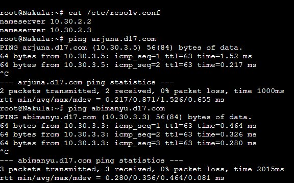

# Jarkom-Modul-2 D17-2023
**Praktikum Jaringan Komputer Modul 2 Tahun 2023**

## Author
| Nama | NRP |Github |
|---------------------------|------------|--------|
|Adam Haidar Azizi | 5025211114 | https://github.com/HADAIZI |
|Ahda Filza Ghaffaru | 5025211144 | https://github.com/Ahdaaa |

## Topologi
  

## Network Configs for Each Nodes

  - **Pandudewanata**
  ```
    auto eth0
    iface eth0 inet dhcp
    
    auto eth1
    iface eth1 inet static
    address 10.30.1.1
    netmask 255.255.255.0
    
    auto eth2
    iface eth2 inet static
    address 10.30.2.1
    netmask 255.255.255.0
    
    auto eth3
    iface eth3 inet static
            address 10.30.3.1
            netmask 255.255.255.0
  ```
  - **Nakula** 
  ```
    auto eth0
    iface eth0 inet static
    address 10.30.1.2
    netmask 255.255.255.0
    gateway 10.30.1.1

  ```
  - **Sadewa**
  ```
    auto eth0
    iface eth0 inet static
    address 10.30.1.3
    netmask 255.255.255.0
    gateway 10.30.1.1
  ```
  - **Yudhistira**
  
    ```
    auto eth0
        iface eth0 inet static
        address 10.30.2.2
        netmask 255.255.255.0
        gateway 10.30.2.1
    ```

  - **Werkudara**
  ```
   auto eth0
        iface eth0 inet static
        address 10.30.2.3
        netmask 255.255.255.0
        gateway 10.30.2.1
  ```

   
 - **Prabukusuma**
 ```
    auto eth0
    iface eth0 inet static
    address 10.30.3.2
    netmask 255.255.255.0
    gateway 10.30.3.1
 ```

 - **Abimanyu**
 ```
    auto eth0
    iface eth0 inet static
    address 10.30.3.3
    netmask 255.255.255.0
    gateway 10.30.3.1

 ```
 - **Wisanggeni**
 ```
    auto eth0
    iface eth0 inet static
    address 10.30.3.4
    netmask 255.255.255.0
    gateway 10.30.3.1
 ```
 - **Arjuna** 
 ```
    auto eth0
    iface eth0 inet static
    address 10.30.3.5
    netmask 255.255.255.0
    gateway 10.30.3.1
 ```

 - **Pandudewanata's .bashrc**
 ```
 iptables -t nat -A POSTROUTING -o eth0 -j MASQUERADE -s 10.30.0.0/16
 ```

 - **Other's .bashrc**
 ```
 echo nameserver 192.168.122.1 > /etc/resolv.conf
 ```

 ## Soal 1
 > Yudhistira akan digunakan sebagai DNS Master, Werkudara sebagai DNS Slave, Arjuna merupakan Load Balancer yang terdiri dari beberapa Web Server yaitu Prabakusuma, Abimanyu, dan Wisanggeni. Buatlah topologi dengan pembagian sebagai berikut. Folder topologi dapat diakses pada drive berikut
 ### Script 
 **Nakula dan Sadewa**
 ```
 ping google.com
 ```
 ### Result

 ## Soal 2
 > Buatlah website utama dengan akses ke arjuna.yyy.com dengan alias www.arjuna.yyy.com dengan yyy merupakan kode kelompok.
 
 ### Solution

 Untuk melakukan pembuatan website utama dengan nama domain arjuna.yyy.com, berikut adalah tahapan-tahapan yang kami kerjakan.

 * Masuk ke node Yudhistira (*DNS Master*), lalu install bind-9 dengan cara berikut

 ```
 apt-get update
 apt-get install bind9 -y
 ```

 * Modifikasi file ``named.conf.local`` pada directory ``/etc/bind/named.conf.local``, dengan isi sebagaimana berikut

 ```
 zone "arjuna.d17.com" {
        type master;
        file "/etc/bind/jarkom/arjuna.d17.com";
 };
 ```

 * Buat folder baru pada directory ``/etc/bind/`` dengan nama ``jarkom``, kemudian copy file ``db.local`` pada directory ``/etc/bind/`` ke dalam   folder baru yang telah dibuat, dengan nama ``arjuna.d17.com``. Lalu, modifikasi file tersebut sebagaimana berikut.

 ```
 ;
 ; BIND data file for local loopback interface
 ;
 $TTL    604800
 @       IN      SOA     arjuna.d17.com. root.arjuna.d17.com. (
                      2022100601         ; Serial
                          604800         ; Refresh
                           86400         ; Retry
                         2419200         ; Expire
                          604800 )       ; Negative Cache TTL
 ;
 @       IN      NS      arjuna.d17.com.
 @       IN      A       10.30.3.5       ; IP Node Arjuna
 www     IN      CNAME   arjuna.d17.com.
 @       IN      AAAA    ::1
 ```
 
 * Lakukan testing website yang telah dibuat dengan cara masuk ke salah satu client (Nakula/Sadewa), pastikan nameserver pada client sudah menuju ke Yudhistira, lalu lakukan ping ke website tersebut.

 ```
 ping arjuna.d17.com
 ping www.arjuna.d17.com
 ```

### Result


## Soal 3
> Dengan cara yang sama seperti soal nomor 2, buatlah website utama dengan akses ke abimanyu.yyy.com dan alias www.abimanyu.yyy.com.

### Solution

Karena cara yang dilakukan sama seperti nomor sebelumnya, maka tahapannya kurang lebih sama, yang menjadi perbedaan hanyalah isi file dari ``named.conf.local`` dan file config baru untuk domain abimanyu.yyy.com yakni ``abimanyu.d17.com``

* Tambah beberapa line berikut ke dalam file ``/etc/bind/named.conf.local``

```
zone "abimanyu.d17.com" {
        type master;
        file "/etc/bind/jarkom/abimanyu.d17.com";
};
```

* Modifikasi file ``/etc/bind/jarkom/abimanyu.d17.com/`` sebagaimana berikut,

```
;
; BIND data file for local loopback interface
;
$TTL    604800
@       IN      SOA     abimanyu.d17.com. root.abimanyu.d17.com. (
                     2022100601         ; Serial
                         604800         ; Refresh
                          86400         ; Retry
                        2419200         ; Expire
                         604800 )       ; Negative Cache TTL
;
@       IN      NS      abimanyu.d17.com.
@       IN      A       10.30.3.3
www     IN      CNAME   abimanyu.d17.com.
@       IN      AAAA    ::1
```

* Lakukan testing kembali ke salah satu client, dengan cara ping website tersebut

```
ping abimanyu.d17.com
ping www.abimanyu.d17.com
```

### Result


## Soal 4 
> Kemudian, karena terdapat beberapa web yang harus di-deploy, buatlah subdomain parikesit.abimanyu.yyy.com yang diatur DNS-nya di Yudhistira dan mengarah ke Abimanyu.

### Solusi

Untuk membuat subdomain ``parikesit.abimanyu.d17.com``, kita perlu melakukan hal berikut

* modifikasi file ``/etc/bind/jarkom/abimanyu.d17.com`` menjadi sebagaimana berikut.

```
;
; BIND data file for local loopback interface
;
$TTL    604800
@       IN      SOA     abimanyu.d17.com. root.abimanyu.d17.com. (
                     2022100601         ; Serial
                         604800         ; Refresh
                          86400         ; Retry
                        2419200         ; Expire
                         604800 )       ; Negative Cache TTL
;
@       IN      NS      abimanyu.d17.com.
@       IN      A       10.30.3.3       ; IP Abimanyu
www     IN      CNAME   abimanyu.d17.com.
parikesit IN    A       10.30.3.3       ; IP Abimanyu
@       IN      AAAA    ::1
```

* Setelah itu lakukan testing pada salah satu client dengan cara berikut

```
ping parikesit.abimanyu.d17.com
```

### Result


## Soal 5
> Buat juga reverse domain untuk domain abimanyu
 
### Solusi

Untuk membuat reverse domain untuk domain abimanyu, maka kita perlu melakukan tahapan berikut.

* Pada node Yudhistira, modifikasi file ``/etc/bind/named.conf.local`` dengan cara menambahkan beberapa baris code berikut.

```
echo '
zone "3.30.10.in-addr.arpa" {
    type master;
    file "/etc/bind/jarkom/3.30.10.in-addr.arpa";
};
' >> /etc/bind/named.conf.local
```

* Kemudian, copy file dari ``/etc/bind/db.local`` menuju ``/etc/bind/jarkom/3.30.10.in-addr.arpa``. Setelah itu, modifikasi file ``3.30.10.in-addr.arpa`` sebagaimana berikut.

```
;
; BIND data file for local loopback interface
;
$TTL    604800
@       IN      SOA     abimanyu.d17.com. root.abimanyu.d17.com. (
                     2022100601         ; Serial
                         604800         ; Refresh
                          86400         ; Retry
                        2419200         ; Expire
                         604800 )       ; Negative Cache TTL
;
3.30.10.in-addr.arpa.   IN      NS      abimanyu.d17.com.
3                       IN      PTR     abimanyu.d17.com.  ; Byte ke-4 Abimanyu
```

* Jika sudah, lakukan testing pada client dengan melakukan command berikut.

```
host -t PTR 10.30.3.3
```

### Result


## Soal 6
> Agar dapat tetap dihubungi ketika DNS Server Yudhistira bermasalah, buat juga Werkudara sebagai DNS Slave untuk domain utama.

Untuk membuat node Werkudara menjadi *DNS Slave* dari node Yudhistira, perlu dilakukan tahapan berikut

* Pada node Yudhistira, masuk ke file ``/etc/bind/named.conf.local``, dan edit zone arjuna dan abimanyu menjadi sebagaimana berikut.

```
zone "arjuna.d17.com" {
        type master;
        notify yes;
        also-notify { 10.30.2.3; }; // IP werkudara slave
        allow-transfer { 10.30.2.3; }; // IP werkudara slave
        file "/etc/bind/jarkom/arjuna.d17.com";
};

zone "abimanyu.d17.com" {
        type master;
        notify yes;
        also-notify { 10.30.2.3; }; // IP werkudara slave
        allow-transfer { 10.30.2.3; }; // IP werkudara slave
        file "/etc/bind/jarkom/abimanyu.d17.com";
};

zone "3.30.10.in-addr.arpa" {
    type master;
    file "/etc/bind/jarkom/3.30.10.in-addr.arpa";
};
```

* Masuk ke node Werkudara, dan install bind9 terlebih dahulu dengan cara berikut.

```
apt-get update
apt-get install bind9 -y
```

* Setelah itu, masuk file ``/etc/bind/named.conf.local`` dan modifikasi agar terlihat seperti ini.

```
zone "arjuna.d17.com" {
    type slave;
    masters { 10.30.2.2; }; 
    file "/var/lib/bind/arjuna.d17.com";
};

zone "abimanyu.d17.com" {
    type slave;
    masters { 10.30.2.2; }; 
    file "/var/lib/bind/abimanyu.d17.com";
};
```

* Lakukan testing dengan cara, matikan bind9 pada yudhis dengan cara

```
service bind9 stop
```

* Lalu, pada Nakula, tambah nameserver yang merujuk ke IP dari Werkudara. Lakukan ping ke arjuna dan abimanyu, harusnya masih bisa.

### Result




## Soal 7 dan 8

> 7. Seperti yang kita tahu karena banyak sekali informasi yang harus diterima, buatlah subdomain khusus untuk perang yaitu baratayuda.abimanyu.yyy.com dengan alias www.baratayuda.abimanyu.yyy.com yang didelegasikan dari Yudhistira ke Werkudara dengan IP menuju ke Abimanyu dalam folder Baratayuda.

> 8. Untuk informasi yang lebih spesifik mengenai Ranjapan Baratayuda, buatlah subdomain melalui Werkudara dengan akses rjp.baratayuda.abimanyu.yyy.com dengan alias www.rjp.baratayuda.abimanyu.yyy.com yang mengarah ke Abimanyu.

Untuk melakukan pembuatan subdomain ``baratayuda.abimanyu.d17.com`` dengan alias ``www``. Kita perlu melakukan tahapan berikut

* Masuk ke node Yudhistira, dan modifikasi file ``/etc/bind/jarkom/abimanyu.d17.com`` menjadi sebagaimana berikut.

```
;
; BIND data file for local loopback interface
;
$TTL    604800
@       IN      SOA     abimanyu.d17.com. root.abimanyu.d17.com. (
                    2022100601          ; Serial
                        604800          ; Refresh
                        86400           ; Retry
                        2419200         ; Expire
                        604800 )        ; Negative Cache TTL
;
@       IN      NS      abimanyu.d17.com.
@       IN      A       10.30.3.3       ; IP Abimanyu
www     IN      CNAME   abimanyu.d17.com.
parikesit IN    A       10.30.3.3       ; IP Abimanyu
www.parikesit   IN      CNAME   parikesit
ns1     IN      A       10.30.2.3       ; IP Werkudara
baratayuda IN   NS      ns1
@       IN      AAAA    ::1
```

Perlu diingat bahwa baratayuda dideklarasikan dari Yudhistira ke Werkudara, sehingga IP pada ns1 merujuk ke IP Werkudara.

* Setelah itu, kita akan memodifikasi file ``/etc/bind/named.conf.options`` menjadi berikut.

```
options {
        directory "/var/cache/bind";

        allow-query{any;};
        auth-nxdomain no;       # conform to RFC1035
        listen-on-v6 { any; };
};
```

* Berpindah ke Node Werkudara, modifikasi file ``/etc/bind/named.conf.options`` sama seperti di node Yudhistira di tahap sebelumnya.

* Kemudian, kita akan menambah zone untuk subdomain baratayuda kedalam file ``/etc/bind/named.conf.options``.

```
zone "baratayuda.abimanyu.d17.com" {
        type master;
        file "/etc/bind/baratayuda/baratayuda.abimanyu.d17.com";
};
```

*  Buat folder baru didalam ``/etc/bind`` dengan nama ``baratayuda``, lalu copy file ``etc/bind/db.local`` menuju ``/etc/bind/baratayuda/baratayuda.abimanyu.d17.com``

```
;
; BIND data file for local loopback interface
;
$TTL    604800
@       IN      SOA     baratayuda.abimanyu.d17.com. root.baratayuda.abimanyu.d17.com. (          
                    2022100601          ; Serial
                        604800          ; Refresh
                        86400           ; Retry
                        2419200         ; Expire
                        604800 )        ; Negative Cache TTL
;
@       IN      NS      baratayuda.abimanyu.d17.com.
@       IN      A       10.30.3.3
rjp     IN      A       10.30.3.3
www     IN      CNAME   baratayuda.abimanyu.d17.com.
www.rjp IN      CNAME   rjp
```

* Lakukan testing pada client dengan cara berikut

```
ping baratayuda.abimanyu.d17.com
ping www.baratayuda.abimanyu.d17.com
ping rjp.baratayuda.abimanyu.d17.com
ping www.rjp.baratayuda.abimanyu.d17.com
```

### Result


## Soal 9 
> 9. Arjuna merupakan suatu Load Balancer Nginx dengan tiga worker (yang juga menggunakan nginx sebagai webserver) yaitu Prabakusuma, Abimanyu, dan Wisanggeni. Lakukan deployment pada masing-masing worker.

Untuk melakukan deployment domain ``arjuna.d17.com`` pada masing-masing worker, perlu dilakukan tahapan berikut

* Masuk ke worker Prabukusuma, install web server nginx, php-fpm, wget, dan juga unzip dengan cara berikut

```
apt-get update
apt-get install nginx -y
apt-get install php php-fpm -y
apt-get install wget -y
apt-get install unzip -y
```

* Buat directory dengan nama ``jarkom`` pada directory ``/var/www``, kemudian download ``arjuna.yyy.com.zip`` dari link google drive pada soal. Unzip file tersebut dan hapus zipnya, lalu pindah file index.php yang ada didalam directory ``arjuna.yyy.com`` ke directory yang dibuat diawal yaitu ``/var/www/jarkom``, diakhiri dengan  dihapusnya directory arjuna.yyy.com. Berikut adalah kode-kode yang perlu dijalankan.
```
mkdir /var/www/jarkom

wget -O /var/www/jarkom/arjuna.yyy.com.zip "https://drive.google.com/u/0/ucid=17tAM_XDKYWDvF-JJix1x7txvTBEax7vX&export=download"

unzip -d /var/www/jarkom /var/www/jarkom/arjuna.yyy.com.zip && rm /var/www/jarkom/arjuna.yyy.com.zip 

mv /var/www/jarkom/arjuna.yyy.com/index.php /var/www/jarkom

rm -r /var/www/jarkom/arjuna.yyy.com
```

* Selanjutnya, kita akan melakukan konfigurasi webserver nginx untuk deployment, dengan cara membuat file ``jarkom`` baru pada directory ``/etc/nginx/sites-available/``. Isi file tersebut sebagaimana berikut.

```
server {

        listen 8001;

        root /var/www/jarkom;

        index index.php index.html index.htm;
        server_name arjuna.d17.com;

        location / {
                        try_files $uri $uri/ /index.php?$query_string;
        }

        # pass PHP scripts to FastCGI server
        location ~ \.php$ {
          include snippets/fastcgi-php.conf;
          fastcgi_pass unix:/var/run/php/php7.0-fpm.sock;
        }

        location ~ /\.ht {
                        deny all;
        }

        error_log /var/log/nginx/jarkom_error.log;
        access_log /var/log/nginx/jarkom_access.log;
}
```

* Setelah konfigurasi nginx untuk arjuna sudah selesai, kita akan membuat symlink dan restart semua service yang ada. Berikut caranya,

```
ln -s /etc/nginx/sites-available/jarkom /etc/nginx/sites-enabled
 
rm -rf /etc/nginx/sites-enabled/default
 
service nginx restart
service php7.0-fpm start
service php7.0-fpm restart
```

* Dengan cara yang sama pada tahap sebelumnya, lakukan juga pada worker Abimanyu dan Wesanggeni. Satu hal yang membedakan hanyalah port listennya (berdasarkan soal 10)

Port Prabukusuma -> 8001
Port Abimanyu    -> 8002
Port Wesanggeni  -> 8003

* Sementara itu, pada Load Balancer yang perlu kita lakukan adalah menginstall nginx terlebih dahulu dengan cara

```
apt-get update
apt-get install nginx -y
service nginx start
```

* Setelah itu, kita perlu membuat file konfigurasi baru untuk worker pada directory ``/etc/nginx/sites-available/`` dengan nama file ``lb-jarkom``. Dengan isi sebagaimana berikut
```
# Default menggunakan Round Robin
upstream myweb  {
    	server 10.30.3.2:8001; # IP Prabukusuma
    	server 10.30.3.3:8002; # IP Abimanyu
    	server 10.30.3.4:8003; # IP Wisanggeni
}
 
server {
    	listen 80;
    	server_name arjuna.d17.com;
 
    	location / {
    	proxy_pass http://myweb;
    	}
}
```

* Jika semua sudah dikonfigurasi, lakukan testing dengan menggunakan command lynx pada client sebagaimana berikut

```
lynx http://arjuna.d17.com
```

Worker yang melakukan *serve* seharusnya dimulai berdasarkan urutan dari round robin pada konfigurasi di arjuna, yaitu Worker Prabukusuma, Worker Abimanyu, dan Worker Wisanggeni.

### Result


> 10. Kemudian gunakan algoritma Round Robin untuk Load Balancer pada Arjuna. Gunakan server_name pada soal nomor 1. Untuk melakukan pengecekan akses alamat web tersebut kemudian pastikan worker yang digunakan untuk menangani permintaan akan berganti ganti secara acak. Untuk webserver di masing-masing worker wajib berjalan di port 8001-8003. Contoh
   > - Prabakusuma:8001
   > - Abimanyu:8002
   > - Wisanggeni:8003

Karena pada tahap 9 kita sudah mengatur port listen dari masing-masing worker, kita hanya perlu melakukan testing ke masing-masing worker dengan cara memanggil ip workernya diikuti dengan portnya, sebagaimana berikut

```
lynx 10.30.3.2:8001
lynx 10.30.3.3:8002
lynx 10.30.3.4:8003
```

### Result


> 11. Selain menggunakan Nginx, lakukan konfigurasi Apache Web Server pada worker Abimanyu dengan web server www.abimanyu.yyy.com. Pertama dibutuhkan web server dengan DocumentRoot pada /var/www/abimanyu.yyy

Untuk melakukan konfigurasi web server apache pada worker abimanyu, perlu dilakukan tahapan-tahapan berikut,

* Install apache2 dan libapache2-mod-php7.0 dengan cara berikut

```
apt-get install apache2
apt-get install libapache2-mod-php7.0
service apache2 start
```

* Selanjutnya, kita akan melakukan pembuatan folder baru di ``/var/www/`` bernama ``abimanyu.d17``, nantinya folder ini akan menyimpan hasil download file terkait web server ``abimanyu.yyy.com`` melalui google drive yang diberikan di soal, unzip kontennya ke directory tadi, hapus zipnya, lalu pindahkan setiap file yang ada di folder ``abimanyu.yyy.com`` yaitu ``index.php``, ``home.html``, dan ``abimanyu.welp`` ke dalam folder yang dibuat di awal. Berikut adalah urutan commandnya,

```
mkdir /var/www/abimanyu.d17 
 
wget -O /var/www/abimanyu.d17/abimanyu.yyy.com.zip "https://drive.google.com/u/0/uc?id=1a4V23hwK9S7hQEDEcv9FL14UkkrHc-Zc&export=download"

unzip -d /var/www/abimanyu.d17 /var/www/abimanyu.d17/abimanyu.yyy.com.zip && rm /var/www/abimanyu.d17/abimanyu.yyy.com.zip

mv /var/www/abimanyu.d17/abimanyu.yyy.com/index.php /var/www/abimanyu.d17/

mv /var/www/abimanyu.d17/abimanyu.yyy.com/home.html /var/www/abimanyu.d17/

mv /var/www/abimanyu.d17/abimanyu.yyy.com/abimanyu.webp /var/www/abimanyu.d17/

rm -r /var/www/abimanyu.d17/abimanyu.yyy.com/
```

* Setelah itu, buat configurasi apache baru di directory ``/etc/apache2/sites-available/`` dengan nama ``abimanyu.d17.com.conf``, isi konfigurasinya sebagaimana berikut

```
<VirtualHost *:80>
        ServerAdmin webmaster@localhost
        DocumentRoot /var/www/abimanyu.d17
        ServerName abimanyu.d17.com
        ServerAlias www.abimanyu.d17.com

        <Directory /var/www/abimanyu.d17>
                Options +FollowSymLinks -Multiviews
                AllowOverride All
        </Directory>

        ErrorLog ${APACHE_LOG_DIR}/error.log
        CustomLog ${APACHE_LOG_DIR}/access.log combined
 
</VirtualHost>
```

* Jika sudah, lakukan deployment webserver apache dengan cara berikut

```
a2ensite abimanyu.d17.com
```

* Lakukan testing pada client dengan command lynx berikut

```
lynx www.abimanyu.d17.com
```

### Result


> 12. Setelah itu ubahlah agar url www.abimanyu.yyy.com/index.php/home menjadi www.abimanyu.yyy.com/home.

Untuk mengubah agar pemanggilan lynx ``www.abimanyu.d17.com/home`` merujuk ke ``www.abimanyu.yyy.com/index.php/home``, perlu dilakukan tahapan berikut.

* Buat sebuah file .htaccess pada directory ``/var/www/abimanyu.d17/`` dan isi sebagaimana berikut,

```
RewriteEngine On
RewriteCond %{REQUEST_FILENAME} !-d
RewriteRule ^([^\.]+)$ index.php/$1 [NC,L]
```

pastikan sudah memanggil ``a2enmod rewrite`` terlebih dahulu.

* lakukan testing di client

### Result


> 13. Selain itu, pada subdomain www.parikesit.abimanyu.yyy.com, DocumentRoot disimpan pada /var/www/parikesit.abimanyu.yyy

Dengan cara yang sama seperti nomor 11, ikuti tahapan berikut untuk melakukan pembuatan subdomain webserver www.parikesit.abimanyu.d17.com

* download keperluan file zip subdomain parikesit dari google drive, lalu unzip file ke directory ``/var/www``, rename folder yang ada di zip menjadi ``parikesit.abimanyu.d17``, lalu buat sebuah folder baru bernama secret dan taruh file html bebas didalamnya sebagaimana berikut.

```
wget -O /var/www/parikesit.abimanyu.d17.zip "https://drive.google.com/u/0/uc?id=1LdbYntiYVF_NVNgJis1GLCLPEGyIOreS&export=download"

unzip -d /var/www /var/www/parikesit.abimanyu.d17.zip && rm /var/www/parikesit.abimanyu.d17.zip

mv /var/www/parikesit.abimanyu.yyy.com /var/www/parikesit.abimanyu.d17

mkdir /var/www/parikesit.abimanyu.d17/secret
```

Isi file html

```
<!DOCTYPE html>
<html>
<head>
    <meta charset='utf-8'>
    <meta http-equiv='X-UA-Compatible' content='IE=edge'>
    <title>Ini Secret</title>
    <meta name='viewport' content='width=device-width, initial-scale=1'>
    <link rel='stylesheet' type='text/css' media='screen' href='main.css'>
    <script src='main.js'></script>
</head>
<body>
    <p>ssshhhh...ini secret bang</p>
</body>
</html>
```

* buat file konfigurasi apache baru untuk domain parikesit di directory ``/etc/apache2/sites-available/parikesit.abimanyu.d17.com.conf``, dan isi filenya sebagaimana berikut

```
<VirtualHost *:80>
        ServerAdmin webmaster@localhost
        DocumentRoot /var/www/parikesit.abimanyu.d17
        ServerName parikesit.abimanyu.d17.com
        ServerAlias www.parikesit.abimanyu.d17.com

        ErrorLog ${APACHE_LOG_DIR}/error.log
        CustomLog ${APACHE_LOG_DIR}/access.log combined
</VirtualHost>
```

* Jika sudah, lakukan deployment domain dengan command berikut

```
a2ensite parikesit.abimanyu.d17.com
```

* lakukan testing di client dengan lynx

```
lynx www.parikesit.abimanyu.d17.com
```

### Result


> 14. Pada subdomain tersebut folder /public hanya dapat melakukan directory listing sedangkan pada folder /secret tidak dapat diakses (403 Forbidden).

Untuk melakukan directory listing pada ``/public`` kita hanya perlu navigasi ke directory tersebut saat melakukan lynx, sehingga tidak ada yang perlu dimodifikasi pada konfig. Sementara itu, untuk melakukan ketiadaan akses untuk folder ``/secret``, tambahkan kode berikut ke dalam file ``/etc/apache2/sites-available/parikesit.abimanyu.d17.com.conf``

```
<Directory /var/www/parikesit.abimanyu.d17/secret>
                Options -Indexes
</Directory>
```

### Result


> 15. Buatlah kustomisasi halaman error pada folder /error untuk mengganti error kode pada Apache. Error kode yang perlu diganti adalah 404 Not Found dan 403 Forbidden

Untuk mengganti halaman error 403 dan 404, kita hanya perlu menambahkan potongan kode berikut ke file ``/etc/apache2/sites-available/parikesit.abimanyu.d17.com.conf``

```
ErrorDocument 404 /error/404.html
ErrorDocument 403 /error/403.html
```

### Result


> 16. Buatlah suatu konfigurasi virtual host agar file asset www.parikesit.abimanyu.yyy.com/public/js menjadi www.parikesit.abimanyu.yyy.com/js

Untuk membuat pemanggilan lynx ``www.parikesit.abimanyu.d17.com/js`` merujuk ke ``www.parikesit.abimanyu.d17.com/public/js``, kita hanya perlu menambahkan potongan kode berikut ke file ``/etc/apache2/sites-available/parikesit.abimanyu.d17.com.conf``

```
Alias "/js" "/var/www/parikesit.abimanyu.d17/public/js"
```

### Result after test


> 17. Agar aman, buatlah konfigurasi agar www.rjp.baratayuda.abimanyu.yyy.com hanya dapat diakses melalui port 14000 dan 14400.

Dengan cara yang sama seperti nomor 11, ikuti tahapan berikut untuk melakukan pembuatan subdomain webserver ``www.rjp.baratayuda.abimanyu.d17.com``

* download keperluan file zip subdomain rjp.baratayuda dari google drive, lalu unzip file ke directory ``/var/www``, rename folder yang ada di zip menjadi ``rjp.baratayuda.abimanyu.d17``.

```
wget -O /var/www/rjp.baratayuda.abimanyu.d17.zip "https://drive.google.com/u/0/uc?id=1pPSP7yIR05JhSFG67RVzgkb-VcW9vQO6&export=download"

unzip -d /var/www /var/www/rjp.baratayuda.abimanyu.d17.zip && rm /var/www/rjp.baratayuda.abimanyu.d17.zip

mv /var/www/rjp.baratayuda.abimanyu.yyy.com /var/www/rjp.baratayuda.abimanyu.d17
```

* buat file konfigurasi apache baru untuk domain rjp.baratayuda di directory ``/etc/apache2/sites-available/rjp.baratayuda.abimanyu.d17.com.conf``, dan isi filenya sebagaimana berikut

```
<VirtualHost *:14000>
        ServerAdmin webmaster@localhost
        DocumentRoot /var/www/rjp.baratayuda.abimanyu.d17
        ServerName rjp.baratayuda.abimanyu.d17.com
        ServerAlias www.rjp.baratayuda.abimanyu.d17.com

        ErrorLog ${APACHE_LOG_DIR}/error.log
        CustomLog ${APACHE_LOG_DIR}/access.log combined
</VirtualHost>
<VirtualHost *:14400>
        ServerAdmin webmaster@localhost
        DocumentRoot /var/www/rjp.baratayuda.abimanyu.d17
        ServerName rjp.baratayuda.abimanyu.d17.com
        ServerAlias www.rjp.baratayuda.abimanyu.d17.com

        ErrorLog ${APACHE_LOG_DIR}/error.log
        CustomLog ${APACHE_LOG_DIR}/access.log combined
</VirtualHost>
```

* modifikasi file ``/etc/apache2/ports.conf`` menjadi berikut

```
Listen 80
Listen 14000
Listen 14400

<IfModule ssl_module>
        Listen 443
</IfModule>

<IfModule mod_gnutls.c>
        Listen 443
</IfModule>
```
* Lakukan deployment domain dengan cara 

```
a2ensite rjp.baratayuda.abimanyu.d17.com
```

* lakukan testing dengan lynx nama domain diikuti portnya

### RESULT


> 18. Untuk mengaksesnya buatlah autentikasi username berupa “Wayang” dan password “baratayudayyy” dengan yyy merupakan kode kelompok. Letakkan DocumentRoot pada /var/www/rjp.baratayuda.abimanyu.yyy.

Untuk menambah autentikasi pada domain rjp.baratayuda, kita hanya perlu melakukan pembuatan 2 file baru di directory ``/var/www/rjp.baratayuda.abimanyu.d17`` dengan nama ``.htppasswd`` dan ``.htaccess``, dengan isi masing-masing sebagaimana berikut,

Isi .htpasswd

```
Wayang:$apr1$hEKgPW6z$ez8I8SzzzSlXVFPUgg67G1
```

Isi .htaccess

```
AuthType Basic
AuthName "Authentication Required"
AuthUserFile /var/www/rjp.baratayuda.abimanyu.d17/.htpasswd
Require valid-user
```

Terakhir, tambahkan potongan kode berikut pada konfig domain apachenya (dikedua port)

```
<Directory /var/www/rjp.baratayuda.abimanyu.d17>
                Options +Indexes
                AllowOverride All
                Require all granted
</Directory>
```

> 19. Buatlah agar setiap kali mengakses IP dari Abimanyu akan secara otomatis dialihkan ke www.abimanyu.yyy.com (alias)

kita hanya perlu menambahkan potongan kode berikut ke file ``/etc/apache2/sites-available/abimanyu.d17.com.conf``

```
ServerAlias 10.30.3.3
```

> 20. Karena website www.parikesit.abimanyu.yyy.com semakin banyak pengunjung dan banyak gambar gambar random, maka ubahlah request gambar yang memiliki substring “abimanyu” akan diarahkan menuju abimanyu.png.

Untuk melakukannya, kita perlu menambah file baru di directory ``/var/www/parikesit.abimanyu.d17/public/images/`` yaitu file ``.htaccess`` dengan isi berikut

```
RewriteEngine On

RewriteCond %{REQUEST_URI} /public/images/
RewriteCond %{REQUEST_URI} (abimanyu.*\.(jpg|png)) [NC]
RewriteRule (.*) /public/images/abimanyu.png [L,R=302]
```

Lalu, di file config domain nya tambahkan potongan kode berikut

```
<Directory /var/www/parikesit.abimanyu.d17/public/images>
                AllowOverride All
</Directory>
```

Lakukan testing pada client ketika mencoba enter ke gambar dengan substring abimanyu

### Result

